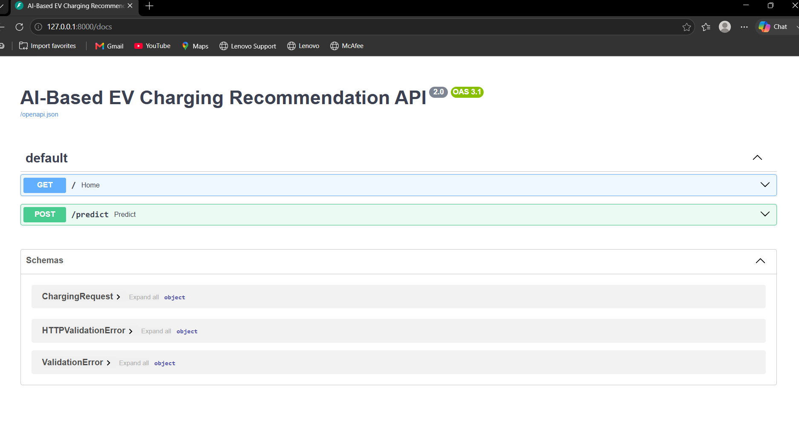
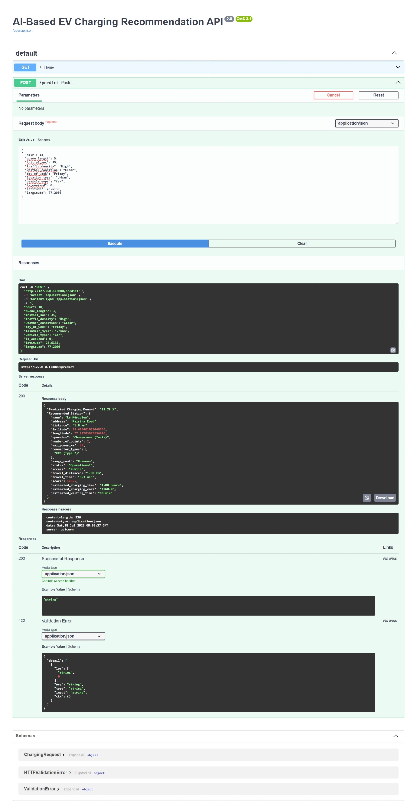

# AI-Based Real-Time EV Charging Recommendation System

## Overview

This project is an AI-powered EV Charging Recommendation System that predicts EV charging demand using Machine Learning and recommends the best nearby charging station based on multiple real-time factors.

The system integrates real-world APIs to provide nearby charging stations and the shortest travel route while estimating charging time, charging cost, and waiting time.

---

## Features

- Predict EV Charging Demand using Machine Learning
- Find Nearby Charging Stations
- Real Driving Distance & Travel Time
- AI-Based Charging Station Recommendation
- Charging Cost Estimation
- Charging Time Estimation
- Waiting Time Estimation
- Swagger API Documentation

---

## Tech Stack

- Python
- FastAPI
- Scikit-learn
- Open Charge Map API
- OpenRouteService API

---

## Project Structure

```text
AI-RealTime-EV-Recommendation-System
│
├── data/
├── images/
├── models/
├── notebooks/
├── services/
├── utils/
├── .gitignore
├── main.py
├── requirements.txt
└── README.md
```

---

## Installation

Clone the repository

```bash
git clone <repository-url>
```

Move into project directory

```bash
cd AI-RealTime-EV-Recommendation-System
```

Create virtual environment

```bash
python -m venv .venv
```

Activate virtual environment

Windows

```bash
.venv\Scripts\activate
```

Install dependencies

```bash
pip install -r requirements.txt
```

Run FastAPI

```bash
uvicorn main:app --reload
```

Open Swagger UI

```
http://127.0.0.1:8000/docs
```

---

## Machine Learning Model

Model Used:

- Random Forest Regressor

Input Features:

- Hour
- Queue Length
- Initial State of Charge (SOC)
- Traffic Density
- Weather Condition
- Day of Week
- Location Type
- Vehicle Type
- Weekend Indicator

Output:

- Predicted Charging Demand

---

## APIs Used

### Open Charge Map API

Used for:

- Nearby Charging Stations
- Charger Details
- Connector Types
- Charger Power

### OpenRouteService API

Used for:

- Real Driving Distance
- Estimated Travel Time

---

## Recommendation Parameters

The recommendation engine considers:

- Distance
- Battery Percentage
- Charger Power
- Number of Charging Points
- Operator Reliability
- Charging Cost
- Charging Time
- Waiting Time
- Travel Distance
- Travel Time

---
---

## Project Screenshots

### 1. Swagger UI

The FastAPI application provides interactive API documentation using Swagger UI, allowing users to test the prediction endpoint directly from the browser.



---

### 2. Prediction Response

The API predicts the EV charging demand and recommends the best nearby charging station by considering charging demand, travel distance, travel time, charger power, charging cost, charging time, and waiting time.



---
---

## Results

The developed system successfully integrates Machine Learning with real-time APIs to recommend the most suitable EV charging station.

### The API provides:

- Predicted EV Charging Demand (%)
- Recommended Charging Station
- Nearby Charging Stations
- Real Driving Distance
- Estimated Travel Time
- Estimated Charging Time
- Estimated Charging Cost
- Estimated Waiting Time
- Charging Station Details (Operator, Connector Type, Charger Power)

### Key Achievements

- Real-time charging station retrieval using Open Charge Map API.
- Real driving route calculation using OpenRouteService API.
- Machine Learning-based charging demand prediction using Random Forest.
- Intelligent recommendation based on charging demand, battery level, travel distance, charger power, waiting time, and station reliability.

---
